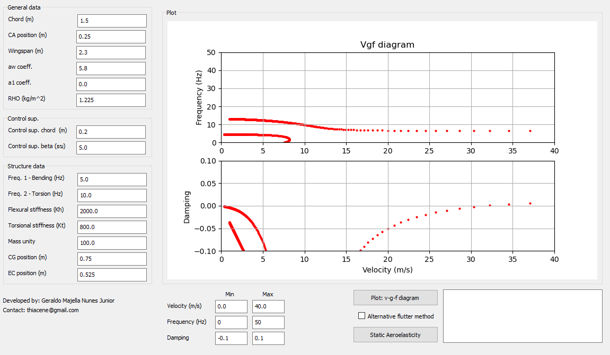
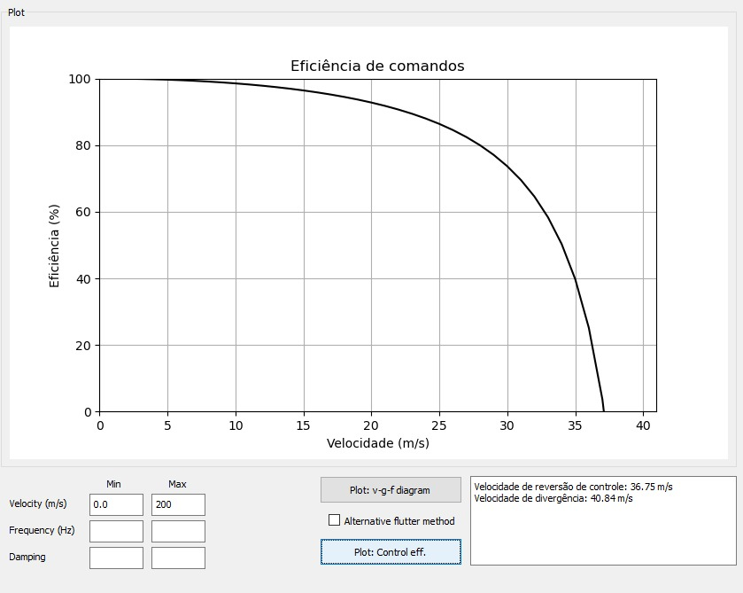

# Aeroelasticity_2D_calculator

O programa foi desenvolvido para cálculos simples de aeroelasticidade estática e dinâmica utilizando sessão típica.

Mdiante inputs do usuário, é calculado a estabilidade aeroelastica para flutter e a resposta para eficiência de comandos bem como também a velocidade de divergência de forma 2D.

